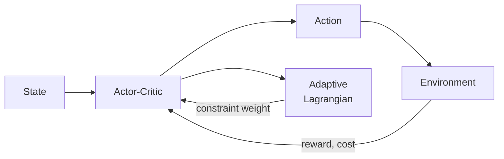

## Key Contributions

- An adaptive Lagrange multiplier schedule that tightens safety constraints as training progresses
- A safety critic architecture that predicts future constraint violations with 85% accuracy
- Empirical validation across six Safety-Gym benchmarks and a physical manipulator

## Method Overview



## BibTeX

```bibtex
@inproceedings{doe2024saferl,
  title     = {Constrained Policy Optimization with Adaptive Safety Boundaries},
  author    = {Doe, Jane and Smith, John},
  booktitle = {Advances in Neural Information Processing Systems},
  year      = {2024}
}
```
